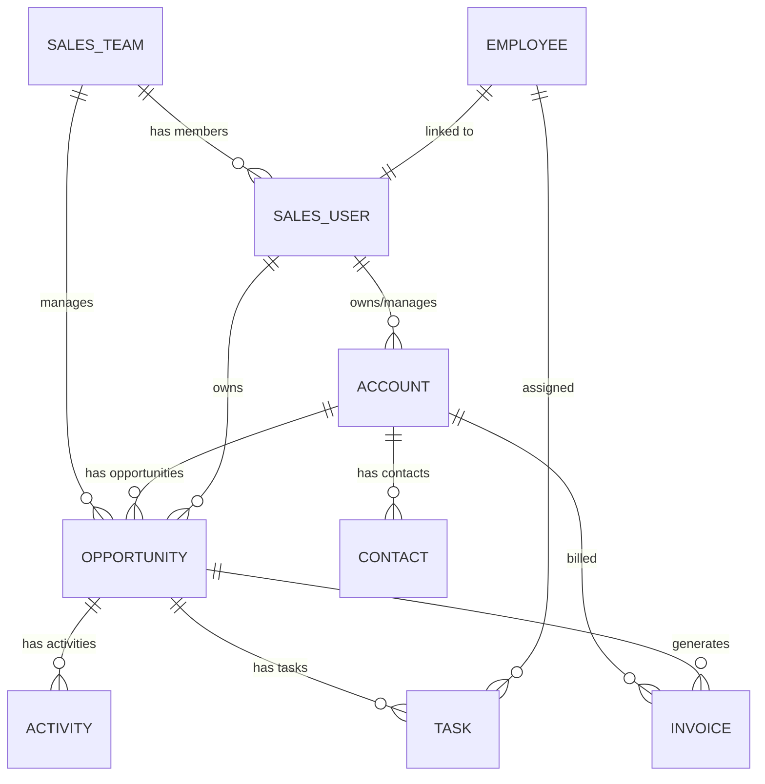

# Data Modeling System

## Overview

This directory contains the **canonical data modeling system** for the Sales KPI ETL pipeline. It provides:

1. **Canonical Schema Definitions** - Pydantic models for all entities
2. **Entity Mappers** - Transform raw Odoo records to canonical format
3. **Relationship Tracking** - Track entity relationships during ETL
4. **Visual Data Model** - Editable YAML spec with generated outputs

## Files

### Source of Truth

- **`sales_model.yml`** - The editable YAML specification for the data model
  - Define entities, fields, types, and relationships
  - Edit this file to modify the model
  - Run generator to update derived files

### Generated Files (from YAML)

- **`sales_model.graph.json`** - React Flow compatible graph for visual editor
- **`sales_model.mmd`** - Mermaid ER diagram for quick review

### Python Code

- **`schemas.py`** - Pydantic models for all canonical entities
- **`mappers.py`** - Entity mappers and RecordRouter
- **`model_generator.py`** - Generate graph.json and .mmd from YAML

## Entities

| Entity | Odoo Source Model | Description |
|--------|-------------------|-------------|
| `sales_user` | `res.users` | Salesperson/System user |
| `sales_team` | `crm.team` | Sales team |
| `account` | `res.partner` (is_company=True) | Company/Organization |
| `contact` | `res.partner` (is_company=False) | Individual contact |
| `opportunity` | `crm.lead` | Sales opportunity/deal |
| `activity` | `mail.activity` | Activity/task on record |
| `invoice` | `account.move` (out_invoice) | Customer invoice |
| `task` | `project.task` | Project task |
| `employee` | `hr.employee` | HR employee record |

## Relationships



## Usage

### 1. Edit the Model

Modify `sales_model.yml` to:
- Add/remove entities
- Change field definitions
- Update relationships

### 2. Regenerate Files

```bash
cd /app/backend/services/data_modeling
python model_generator.py --generate
```

### 3. Use in ETL

```python
from services.data_modeling.mappers import RecordRouter

# Create router for source system
router = RecordRouter(source_system="odoo", org_id="my_org")

# Route records to correct mapper
for record in raw_records:
    canonical_record, relationship_edges = router.route(
        record, 
        source_model="crm.lead"
    )
    if canonical_record:
        # Load to canonical database
        pass
```

## Identity Rules

Every canonical record has:
- `canonical_id`: `{source_system}_{entity}_{source_record_id}`
- `org_id`: Organization/tenant ID
- `source_system`: Source system name (e.g., "odoo")
- `source_record_id`: Original ID from source

## Null Handling

| Odoo Value | Canonical Value |
|------------|----------------|
| `false` | `None` (for scalars) |
| `[]` | `[]` (empty array) |
| `0` | `0` (keep numeric zero) |
| `[id, 'name']` | Extract via `extract_id()` / `extract_name()` |
